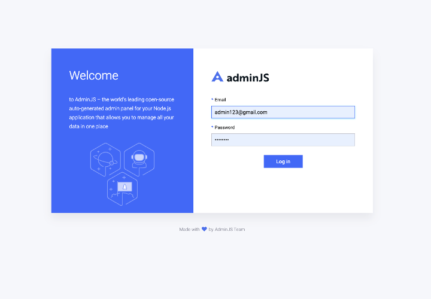
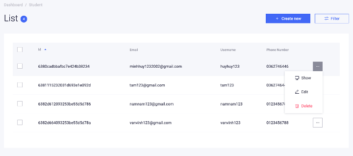
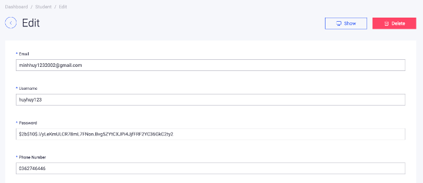
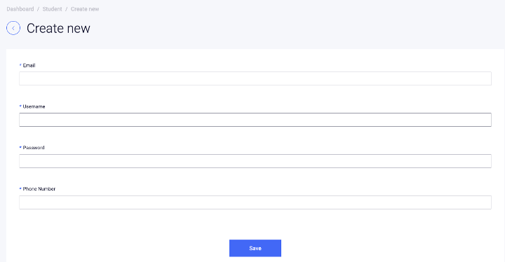
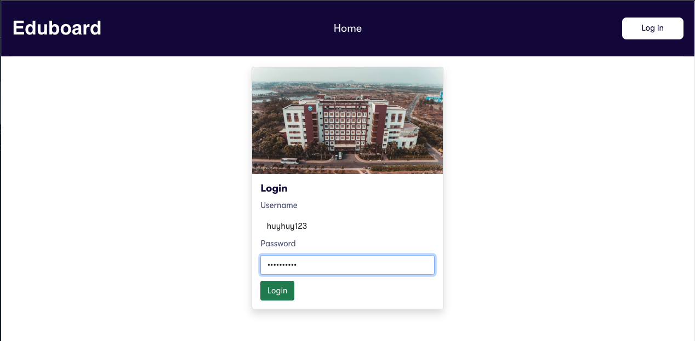
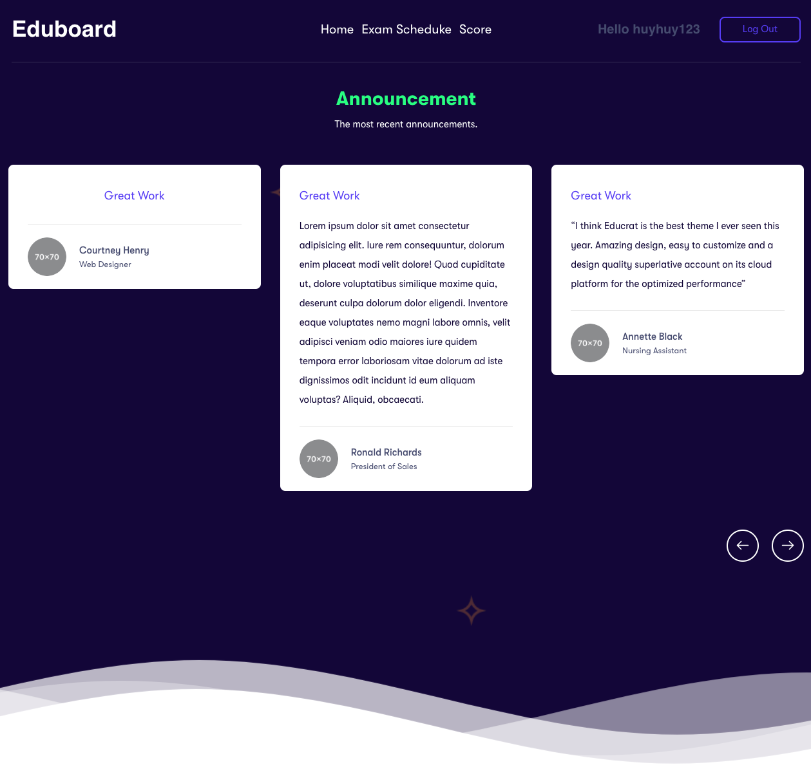
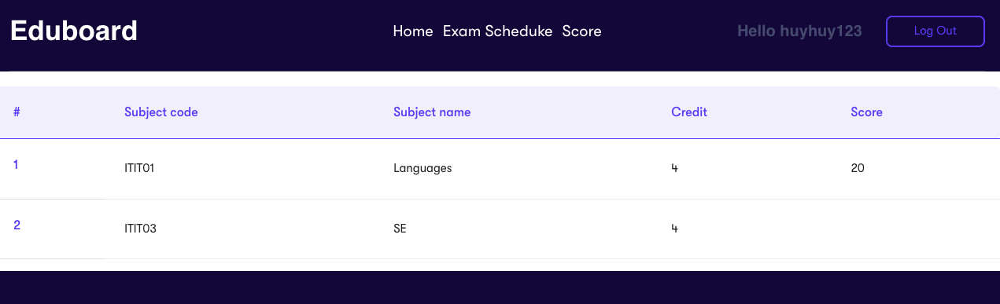
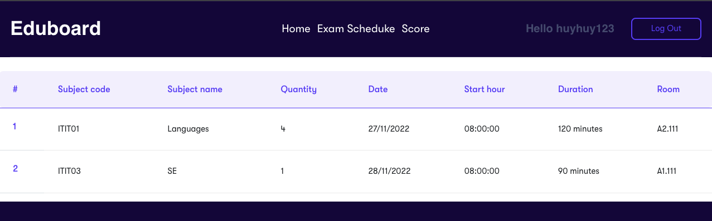

# Online Examination System
## Installation
- Install Node.js.
- Clone repository.
- Run <code>npm install</code> to install
## Documentation
- Login to admin page:
    - email: admin123@gmail.com
    - password: admin123
- CRUD students, records, exams, courses.

## Endpoints
> Students end  point :
>  - <code>GET</code> **/examSchedule** - LIST all examination schedule.
>  - <code>GET</code> **/score** - LIST all scores related to students' exam.
>  - <code>GET</code> **/login** - RENDER login page.
>  - <code>POST</code> **/login** - Login the student dashboard
>  - <code>POST</code> **/logout** - Logout the student dashboard.

>  Admin end point: 
>    - <code>GET</code> **/admin/login** - RENDER a login page for admin
>    - <code>GET</code> **/courses/:id** - GET a course by ID
## Screenshots 
### Admin Page
| |
|:---:|
| **Admin login**|

| |
|:---:|
| **Show all colections with CRUD operation**|

| |
|:---:|
| **Edit form page**|

| |
|:---:|
| **Insert form page**|

### Student Page
| |
|:---:|
| **Student login**|

| |
|:---:|
| **Student home page**|

| |
|:---:|
| **Score sheet**|

| |
|:---:|
| **Exam schedule**|

## Tech stacks
### Front-end
- Bootstrap 
### Back-end
- Node.js (Express) 
- MongoDB (Mongoose)

## Contributing
Huynh Van Vinh - ITITIU19248
 
Nguyen Tran Hoang Nam - ITITWE18013
 
Nguyen Vu Nhat Quang - ITITIU20149 
 
Nghe Thi Thanh Tam - ITITIU20302
  
Tran Minh Huy - ITITIU20219 - **Leader**
